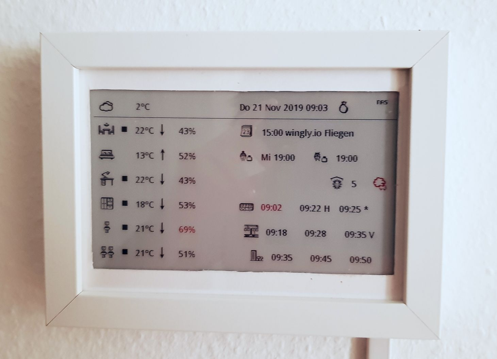
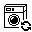
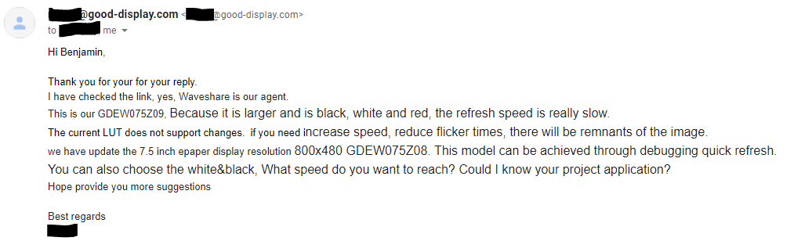

# Quietpaper - Smart Home Display Project



This is a passion project that realizes an Raspberry-Pi-based smart home display 
using the [3-color Waveshare e-Paper Display 7.5 inch](https://www.waveshare.com/w/upload/b/b6/7.5inch-e-paper-specification.pdf).
I wanted to make a device my smart home control station that does not emit blueish light,
that is quiet and does not listen or talk (unlike Alexa, Google & co.) and generally
provides a zen-like user experience and still integrates well with various APIs. Here
now the code is, ready to be used and extended by you!

The application structure is modular and supports multiple **widgets** (as information
windows) and **displays** (as information projection screen) so integration into other
media is feasible (for example, currently the image is not only shown on the e-paper
display but also saved as PNG and uploaded to Google-Docs for remote-display).

The application is developed as Python application that can be run as a linux
daemon and update the system at regular times (currently multiples of 5 minute steps
which I found best for the slow refresh cycles of the Waveshare display).

Here are some other libraries and projects that were helpful and/or whose code I 
ended up incorporating into this project:

* [`rgerganov/py-air-control`](https://github.com/rgerganov/py-air-control/) - Command
  Line App for controlling Philipps Air Purifier - modified version stored at 
  `quietpaper/iot/airctrl.py`
* [`public-transport/db-vendo-client`](https://github.com/public-transport/db-vendo-client) - 
  provides Deutsche Bahn API calls for public transit timetables via NodeJS;
  requires a NVM and NodeJS installation that is set up during `install-and-autorun.bash`
* [`momorientes/istheutefeinstaubalarm`](https://github.com/momorientes/istheutefeinstaubalarm) - 
  my town Stuttgart, Germany provides "Smog Alerts" on which days we should 
  leave our cars at home, use public transit for lower price (in some cases
  even for free) and cannot use "recreational home fireplaces". This project
  provided the inspiration on how to query if such a smog alert is currently
  in effect: by scraping the city's minimalistic mobile-phone widget HTML page.
* [`albertogeniola/MerossIot`](https://github.com/albertogeniola/MerossIot) - library
  to access power consumption data of the Meross Smart Home Power Plugs
* [Tado API Guide - updated for 2019](https://shkspr.mobi/blog/2019/02/tado-api-guide-updated-for-2019/) - 
  huge help in understanding how to query the undocumented API of my tado thermostats.
* [Tutorial on Programming a Waveshare 7.5-Inch Multi-Color e-Paper Display & Info-Frame](https://www.youtube.com/watch?v=mr6Lt0gKjsI&t=200s) - 
  very great tutorial to get started with the Waveshare. I took the Weather-Display logic
  directly from that tutorial.

## Install / Run


1. You need the following prequisites:
* Raspbian Bullseye Image with Python 3.9(.2) installation
* Display connected to Raspberry
* SPi interface enabled: type `sudo raspi-config` -> Interface Options -> SPI -> Yes.
* The font with which displaying happens:
```bash
mkdir -p /usr/share/fonts/truetype/wqy/
sudo curl https://github.com/anthonyfok/fonts-wqy-microhei/raw/master/wqy-microhei.ttc -o /usr/share/fonts/truetype/wqy/wqy-microhei.ttc
```

2. Next, if you want to use all widgets exactly in the layout I use you can just copy
the folder `secret.template`, rename it to `secret` and open the config files within
replacing all access keys, passwords and personal data with values that apply to your
situation.

3. If you would like another configuration, you might want to develop own widgets or 
re-arrange them. For this, see the next chapters. You might at least want to edit
the file `quietpaper/config.py` which sets the layout of the widgets on the display.

4. Installing will build a few packages from their Python Wheels Sources. For this
process you need (once, you can uninstall those programs after the installation process):
```bash
sudo apt-get install libjpeg-dev zlib1g-dev # for installing pip Pillow from source
sudo apt-get install python-dev libatlas-base-dev # for installing Numpy from source
curl --proto '=https' --tlsv1.2 -sSf https://sh.rustup.rs | sh # for installing cryptography from source --> Press "1"
sudo apt-get install libssl-dev # also required for building cryptography
```

5. You can then install the `quietpaper` daemon (Python app which updates the display) 
by calling:
```bash
./install-and-autorun.bash
```

6. The display will now load! - You can start/stop/restart the daemons by calling
```bash
sudo service {start|stop|restart} quietpaper
```
... or, after stopping the services, run them directly with:
```bash
./quietpaper.bash
```

## Widgets


The core of this project are its "widgets", the different information snippets
displayed. The following widgets are developed (and stored in the subfolder
`quietpaper/widgets`):

| Python file     | Icons | Description |
|-----------------|-------|-------------|
| `allergy.py`    |  | air quality as  reported by Philipps Air Purifier and (potentially some time in the future) also the air quality reported outdoors on "some" public website |
| `cal.py`        |       | the next appointment on some Google calendar 
| `clock.py`      | -     | time and date (during night/workday, the time is hidden because the display uses a longer update cycle) |
| `commute.py`    | , ,  | upcoming routes from your home into the city assuming a "bus -> train -> city" route (as it is the case in my current home); can also show additional information such as bus/train leaving from another station (small character suffix) or delays in the bus/train timetable (small `+...` suffix) |
| `monitor.py`    | , ,  | small symbols indicating if some of your electronic devices are running or down (Network Attached Storage, VPN, internet connection) |
| `office.py`     | ,  | showing ONLY the time of your first appointment at work in the morning (for work-life-balance-purposes hiding the title etc. in order not to break you out of your home-sweet-home feel); uses either a Google Docs Sheet (which you can fill by other means) or a Google Calendar as source for this information; also can add an asterisk if the appointment is marked as "special" |
| `room.py`       | , , , , , ,  | room climate information from tado thermostats including temperature, warm-up/cool-down indicator (, , window-open indicator and humidity as well as humidity "alarm"; window-open indicator supports three states: window closed (), window open (), "window was already opened to let fresh air in today" (no icon) |
| `separator.py`  | -     |  a straight horizontal line |
| `smog.py`       |  | indicates whether the city of Stuttgart currently has a smog alert or not |
| `trashday.py`   | , , ,  | displays whether it is a day where we should put out the garbage to be picked up (for different kinds of garbage: bio , paper , recycle , waste ) |
| `wheather.py`   | icons based on font `font/meteocons-webfont.ttf` | weather information from https://api.openweathermap.org |
| `laundry.py`    | , , ,  | Indicator whether the washing machine and dryer (in our basement) is running or done. Computes this by using power usage metrics from smart home plugs from meross. |

## Develop


If you want to modify this project and/or adapt it to your need, here are some
pointers about the repo's directory structure:

* `data` - contains static data displayed by some widgets, e.g. the dates used by
  the `trashday.py` widget
* `doc` - contains artifacts for this document
* `fonts` - fonts used on the display
* `icons` - bmps and gifs of the icons displayed on screen (only bmps are actually
  used in the code)
* `log` - directory where log is stored
* `output` - directory where png images are stored for debug purposes
* `quietpaper` - the main python application (python module) with the following 
  submodules
  * `iot` - logic to interface with devices (e-paper display, air purifier, tado
    thermostat)
  * `screens` - classes that provide interfaces for displaying the final image
  * `widgets` - classes that retrieve information from other sources and render
    it onto the screen
* `secret.template` - template of config files that contain all necessary access
  keys, passwords and personal information. Before launching the application
  copy this directory to `secret` and replace all placeholders

For development on Raspberry Pi, I recommend Visual Studio Code with Remote 
Development Extension as well as NoMachine to login to the Raspberry. Happy 
Developing!

## Speeding Up the Refresh Rate



At the time of this writing this application is running for about a month and 
the display is holding up very well! The only caveat is the slow refresh rate
of the display (about 30 seconds) which limits the acceptable display refresh 
rate to once every five minutes.

Applied Science on Youtube has produced an excellent video 
["E-paper hacking: fastest possible refresh rate"](https://www.youtube.com/watch?v=MsbiO8EAsGw)
but unfortunately the technologies used seem not available for the 7.5 inch display.
The code in the respective places is left out, there are some vague hints at 
respective byte sequences in the spec sheet but corresponding reference VCOM 
LUT tables are documented nowhere.

Asking both at the very friendly support of Waveshare and at Good Display 
they essentially discouraged me from experimenting with the LUT table even hinting 
at that it might not be possible. As you can see they have a 
[successor in their portfolio](https://www.aliexpress.com/item/4000091942229.html) though. 
If anyone has experience with it or reverse engineers the LUT and finds a quicker setting
that does not fry the display, let me know at `post at benkku dot com`!
